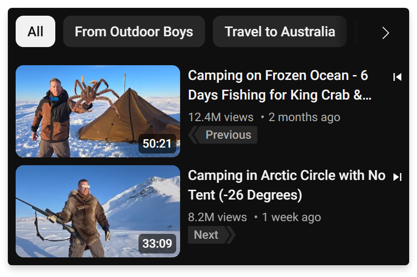
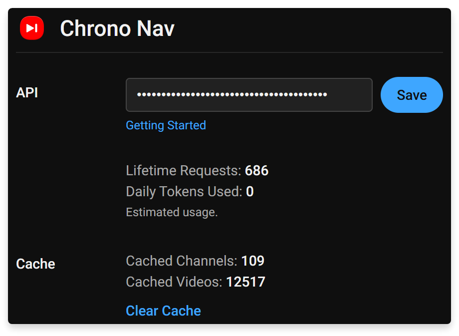

# Chrono Nav for YouTube

  

Adds newer/older videos from the current channel to the top of YouTube's recommended list.

  

## Features

  

* **Chronological Video Navigation:** Adds newer/older videos from the current channel to the top of YouTube's recommended list, specific to the current channel.

* **Optimized Data Fetching:** Uses channel RSS feeds for recent video data (15 latest) and the YouTube Data API (v3) for complete video history and details.

* **Local Cache:** Stores fetched video information to help future navigation and minimize unnecessary API calls.

* **API Support:** Allows users to supply their own YouTube Data API key for access to full video history and metadata.

  

## Optimizations & API Usage

  

* **Staged Data Fetching:** Prioritizes RSS feeds (no API quota cost) for initial data. API calls are only made when older videos or specific details are required.

* **Caching:** Local storage prevents unnecessary API calls.

* **API Quota:**

	* Operates within the YouTube Data API v3's free daily quota (default 10,000 points).

	* A single navigation can use anywhere from 0 to 200 tokens, depending on how old the current video is. To use 200 tokens, the video would need to be the 10000th upload on the channel. 200 tokens is 2% of the daily free quota.

	* Includes a limit for each navigation to minimize the chances of quickly hitting the quota. Even with heavy usage, exceeding the free quota is unlikely.

* **Seamless Design:** Injected videos are styled by cloning existing YouTube page elements.

  

## Screenshots

  

**Videos injected to the top of the YouTube sidebar:**

  

**The popup for API key management, cache statistics, and API token usage:**

  

## Getting the Extension

  

* **Firefox:**  [Mozilla Add-on Store](https://addons.mozilla.org/en-US/firefox/addon/chrono-nav-for-youtube/)

* **Other Browsers:** [GitHub Releases](https://github.com/KuroZantetsuken/Chrono-Nav/releases).

  

## API Key

  

Using a YouTube Data API v3 key is optional but recommended for accessing full channel video history and detailed metadata (like duration/view counts). RSS feeds are used otherwise.

You can obtain a free API key from the [Google Cloud Console](https://console.cloud.google.com/) and enter it into the extension's popup.

To get a YouTube Data API key, follow these steps:

1.  **Go to the Google Cloud Console.** You'll need to log in with your Google account.
2.  **Create a new project.** If you don't have one already, give your project a name.
3.  **Enable the YouTube Data API v3.** In the API Library, search for "YouTube Data API v3" and enable it for your project.
4.  **Create credentials.** Navigate to the "Credentials" page. Click on "Create credentials" and select "API key". Your API key will then be generated.

  

## License

  

This software is released into the public domain. See the `LICENSE` file for more details.

([The Unlicense](https://unlicense.org/))
